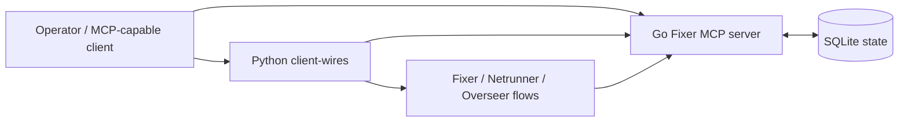

# Fixer MCP

Durable orchestration control plane for multi-agent coding work.

Fixer MCP is built for teams who are done with agent runs that feel fast for 20 minutes and chaotic for the next two days. It keeps orchestration state, role boundaries, review flow, and tool assignment explicit, so work can be delegated, resumed, audited, and accepted without collapsing into terminal history.

## Why This Exists

Most multi-agent setups break in the same place:
- context disappears after a restart
- the wrong worker gets resumed
- review authority is informal instead of enforced
- tool access becomes global chaos
- project memory lives in chat instead of in the system

Fixer MCP treats those as runtime objects, not team rituals.

## What It Solves

- durable task state across handoffs and restarts
- explicit review and acceptance before work is considered done
- project-scoped canon docs attached to the work itself
- governed delegation with per-task MCP assignment
- launch and wait primitives for long-running workers
- resumable operator workflows instead of one-shot agent bursts

## The Actors

- `Fixer` 🛠️: orchestrates work, dispatches sessions, reviews results, and updates canon
- `Netrunner` ⚡: implements changes, runs checks, and submits completion reports
- `Overseer` 🧠: inspects a workspace at a higher level and decides which worker path is appropriate

## Why It Is More Than A Prompt Pack

Fixer MCP is not a prompt collection with a launcher attached.

The Go server owns durable orchestration state:
- sessions
- handoffs
- canon docs
- proposals
- MCP assignment
- launch metadata
- review lifecycle

The Python launcher layer turns that state into real execution flows for Fixer, Netrunner, and Overseer. That split is what makes the system controllable instead of theatrical.

## Why This Architecture Matters

The MCP-server form factor gives you more than a thin wrapper around a CLI:
- one durable control plane multiple clients can talk to
- project memory that survives model/session churn
- reviewable orchestration instead of chat-only coordination
- external worker launches that still stay attached to canon and lifecycle state
- room for governed delegation, resumability, and backend-aware execution

If you only want lightweight coordination, this is probably more structure than you need.

If you want multi-agent work that stays legible after restarts, handoffs, and review, this architecture is the point.

## Quick Start

Fastest path to something real:

```bash
cd packages/fixer-mcp-server && make build && ./fixer_mcp
```

Fastest path to the staged launcher surface:

```bash
python3 -m pip install -e ./packages/client-wires
fixer --wire-info
fixer
fixer-client-wires list-roles
```

Running `fixer` now restores the phased first step: the operator chooses `fixer`, `netrunner`, or `overseer` before continuing into the newer launch flow. Pass `--role` only when you intentionally want a non-interactive bypass.

If you want to preview the packaged launch plan instead of executing it:

```bash
fixer --dry-run
fixer-client-wires plan-launch --role fixer --backend codex --mcp-server fixer_mcp
```

The launcher resolves runtime and config through the public contract first:
- `FIXER_CLIENT_WIRES_RUNTIME_ROOT`
- `FIXER_CLIENT_WIRES_CONFIG_PATH`
- `FIXER_CLIENT_WIRES_STATE_ROOT`

The packaged wrapper keeps `fixer_mcp` state in `~/.local/state/fixer-client-wires/` by default and auto-builds the staged Go server when needed. The repo-owned `fixer` command now comes directly from `packages/client-wires`; it starts with a phased interactive operator flow: role selection first, then Fixer `Start new` vs `Resume existing`, then backend/model/reasoning prompts for fresh launches. `packages/compat-bridge` and `fixer_compat_bridge` remain optional compatibility surfaces for operators who still want the old flag shape through `fixer-compat-bridge`, while the old copy-and-strip export path remains compatibility-only rather than part of the primary install story.

## Architecture



## Project Layout

```text
apps/
  fixer-desktop/      Flutter desktop shell for the first operator UI slice
packages/
  desktop-bridge/     local read-oriented HTTP projection over Fixer SQLite state
  fixer-mcp-server/   Go control plane
  client-wires/       Python launcher package
  compat-bridge/      compatibility wrappers for legacy-style flows
docs/                 architecture, onboarding, compatibility, release docs
examples/             starter config examples
scripts/              repo-native release tooling
tests/                repo-level validation
```

## Documentation

- [Onboarding](docs/onboarding.md)
- [Architecture](docs/architecture.md)
- [Compatibility](docs/compatibility.md)
- [Migration Plan](docs/migration-plan.md)
- [Implementation Slices](docs/implementation-slices.md)

The repo-native release path is driven by `scripts/release_public_repo.py`, which assembles a publishable `assembly/github_repo/` payload instead of relying on the legacy export pipeline.

## First Desktop Slice

The first desktop slice now lives in:

- `apps/fixer-desktop`
- `packages/desktop-bridge`

The bridge reads the same SQLite state used by the current Fixer MCP control plane and exposes a small local HTTP contract for the Flutter shell.

## Deep Dive

For maintainers, release mechanics, and migration internals, see [CONTRIBUTING.md](CONTRIBUTING.md).
