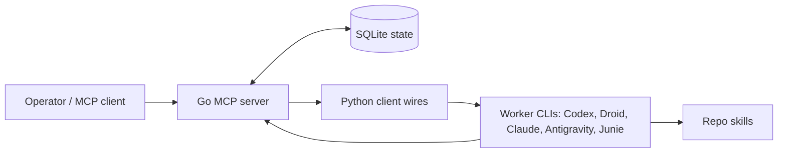

# Fixer MCP

Fixer MCP is a local-first control plane for durable, reviewable, resumable multi-agent coding work.

It exists for teams and solo operators who want agent runs to leave behind structured state: tasks, role boundaries, project canon, handoffs, tool assignment, progress logs, review decisions, and recovery handles. The point is not to make workers magically correct. The point is to make delegation inspectable and restartable.

## Roles

- Fixer: plans work, owns scope, routes sessions, and reviews before acceptance.
- Netrunner: executes one scoped task, changes code, runs checks, and reports evidence.
- Overseer: coordinates across projects and routes work to the right Fixer.

## Architecture



The Go MCP server owns durable orchestration state. The Python client wires turn that state into role launches and worker resumes. SQLite is the local source of truth. Skills are shipped as product behavior, not as private notes.

## Quick Start

Prerequisites:

- Go 1.25.4 or newer
- Python 3.12 or newer
- Node.js for the bridge and Docker smoke flows
- Codex CLI authenticated if you want Codex-backed worker launches

Build the MCP server:

```bash
cd fixer_mcp
go build ./...
```

Run the server locally:

```bash
go run .
```

Set a shell alias if you want a short entry point (replace the path with your checkout location):

```bash
alias fixer='python3 /path/to/fixer-mcp/client_wires/fixer_wire.py'
```

Start with one project by launching the Fixer role and registering the project root through the MCP tools exposed by the server:

```bash
python3 client_wires/fixer_wire.py --role fixer
```

## Documentation Map

- `fixer_mcp/README.md`: MCP server details.
- `client_wires/README.md`: launcher and worker wiring.
- `.agents/skills/`: canonical role workflows used by Fixer, Netrunner, and Overseer.
- `docs/README.md`: public docs index.
- `docs/docker-smoke.md`: clean smoke and bootstrap E2E notes.
- `docker/`: validation containers and scripts.

## Validation

```bash
python3 -m unittest discover -s client_wires/tests
cd fixer_mcp && go build ./... && env -u FIXER_MCP_LOCKED_ROLE go test ./...
make docker-smoke
make docker-bootstrap-e2e
```

`docker-smoke` is the deterministic clean check. `docker-bootstrap-e2e` is a heavier end-to-end path that depends on Docker, network access, and authenticated CLI state.

## Current State

Fixer MCP is local-first and designed for a single operator. The primary interface is terminal/TUI oriented, with a desktop workspace under active development. The public repo intentionally avoids cloud coordination claims, auto-merge claims, and unattended production promises.

## Contributing

Useful contributions are concrete: clearer docs, tighter smoke tests, safer role boundaries, better import/export hygiene, and adapters for worker CLIs that preserve reviewability. Keep changes small enough to review and include the commands you ran.
