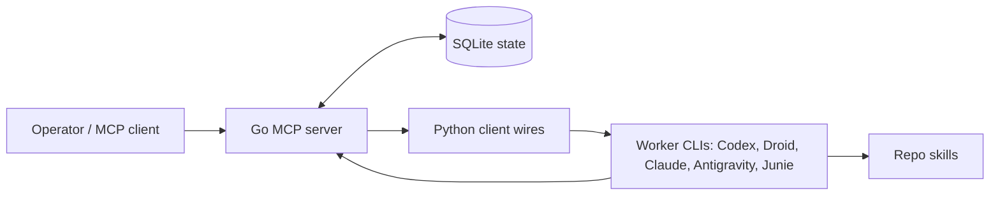

# Fixer MCP

Fixer MCP is a local-first control plane for durable, reviewable, resumable multi-agent coding work.

It exists for teams and solo operators who want agent runs to leave behind structured state: tasks, role boundaries, project canon, handoffs, tool assignment, progress logs, review decisions, and recovery handles. The point is not to make workers magically correct. The point is to make delegation inspectable and restartable.

## Roles

- Fixer: plans work, owns scope, routes sessions, and reviews before acceptance.
- Netrunner: executes one scoped task, changes code, runs checks, and reports evidence.
- Overseer: coordinates across projects and routes work to the right Fixer.

## Architecture


```mermaid
flowchart LR
    Client["Operator / MCP client"]
    Server["Go MCP server"]
    DB[("SQLite state")]
    Wires["Python client wires"]
    Workers["Worker CLIs: Codex, Droid, Claude, Antigravity, Junie"]
    Skills["Repo skills"]

    Client --> Server
    Server <--> DB
    Server --> Wires
    Wires --> Workers
    Workers --> Server
    Workers --> Skills
```

The Go MCP server owns durable orchestration state. The Python client wires turn that state into role launches and worker resumes. SQLite is the local source of truth. Skills are shipped as product behavior, not as private notes.

## Quick Start

Prerequisites:

- Go 1.25.4 or newer (the installer builds the MCP server from source)
- Python 3.12 or newer
- Node.js for the bridge and Docker smoke flows
- Codex CLI authenticated if you want Codex-backed worker launches

Install, then verify, one command each:

```bash
git clone git@github.com:kamenetskiy-to/fixer-mcp.git fixer-mcp
cd fixer-mcp
make install-verify
```

`make install-verify` builds a release from this checkout, installs it into `~/.fixer` behind an atomic `current` symlink, writes the `fixer` shim to `~/.local/bin`, and verifies the installation (version identity, doctor, clean MCP stdio initialization, self-update check). Add `~/.local/bin` to `PATH`, then start with one project by launching the Fixer role from that project's root. The launcher creates the project record automatically when the cwd is new:

```bash
fixer --role fixer
```

See `AGENTS_INSTALLATION.md` for the receiving-agent checklist and `docs/public-repo-installation.md` for installer internals, overrides, and update behavior.

## Install And Update

There is exactly one supported install path: the managed portable installer in this repository (`installer/`, `packaging/`, `bin/fixer`, `scripts/install/`).

```bash
make install              # build a release from this checkout and install it
make install-verify       # install, then verify the installation
```

```bash
fixer --version
fixer doctor
fixer update --check      # compare against the recorded release source
fixer update               # re-apply the recorded release source
fixer update --descriptor <url-or-path>   # switch to another release source
```

The installer keeps the descriptor and payload it installed from in `<managed root>/update-source/<version>/`, so an installation can check for and apply updates without the original checkout. Overridable locations: `FIXER_MANAGED_ROOT` (`~/.fixer`), `FIXER_USER_BIN` (`~/.local/bin`), `FIXER_STATE_DIR` (`$XDG_STATE_HOME/fixer-client-wires`, or `~/.local/state/fixer-client-wires`), and the prefix shorthand `FIXER_INSTALL_PREFIX` (installs the shim into `<prefix>/bin`). `RELEASE_VERSION` selects the version built and installed.

Installation is idempotent and never edits shell startup files: it replaces only the releases and shim it manages and leaves SQLite state, project files, and credentials alone. Run the launcher straight from the checkout without installing:

```bash
make launcher        # == python3 bin/fixer
```

## Documentation Map

- `fixer_mcp/README.md`: MCP server details.
- `client_wires/README.md`: launcher and worker wiring.
- `.agents/skills/`: canonical role workflows used by Fixer, Netrunner, and Overseer.
- `docs/README.md`: public docs index.
- `docs/public-repo-installation.md`: managed installer, overrides, and updates.
- `docs/public-repo-export.md`: how this repository is generated from the private workspace.
- `docs/docker-smoke.md`: clean smoke and bootstrap E2E notes.
- `AGENTS_INSTALLATION.md`: receiving-agent installation and verification contract.
- `installer/`: managed install, update, and doctor implementation.

## Validation

```bash
python3 -m unittest discover -s client_wires/tests
cd fixer_mcp && go build ./... && env -u FIXER_DB_PATH -u FIXER_MCP_LOCKED_ROLE -u FIXER_MCP_DEFAULT_ROLE -u FIXER_MCP_DEFAULT_CWD -u FIXER_MCP_AUTO_AUTH -u FIXER_MCP_TOOL_PROFILE go test ./...
make install-verify
make docker-smoke
```

`make install-verify` is the deterministic installation gate: it installs into a prefix (use `FIXER_USER_BIN` and `FIXER_MANAGED_ROOT` to keep it out of your home directory) and then checks version identity, doctor health, a fresh SQLite initialization through MCP stdio, and the self-update check. `docker-smoke` is the clean-container gate. `docker-bootstrap-e2e` is an optional manual path that depends on Docker, network access, and authenticated Codex CLI state.

## Current State

Fixer MCP is local-first and designed for a single operator. The primary interface is terminal/TUI oriented, with a desktop workspace under active development. The public repo intentionally avoids cloud coordination claims, auto-merge claims, and unattended production promises.

## Contributing

Useful contributions are concrete: clearer docs, tighter smoke tests, safer role boundaries, better import/export hygiene, and adapters for worker CLIs that preserve reviewability. Keep changes small enough to review and include the commands you ran.
