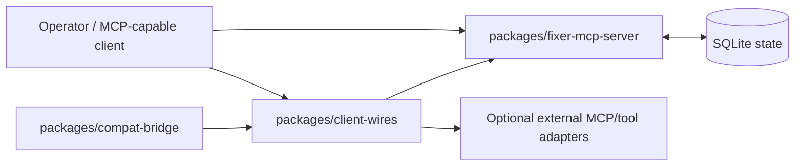

# Architecture

## Problem Statement

The current system works, but the public path is still shaped by a private operator workspace. The worst coupling points are:

1. `client_wires/bootstrap.py` requires a shared launcher runtime from a sibling `mcp_servers` checkout or an environment override.
2. `client_wires/fixer_wire.py` assumes repo-root config discovery and private bootstrap behavior.
3. `scripts/prepare_public_repo.py` publishes a cleaned export from the legacy workspace instead of treating the public repo as the canonical source tree.
4. Public docs still expose internal implementation details like export mechanics and workspace archaeology.

## Design Principles

- The GitHub repo must be self-describing and runnable without private sibling checkouts.
- The control plane remains the product center; launch wires are packaged as an optional but supported layer.
- Backward compatibility stays explicit instead of accidental.
- Migration boundaries must keep the legacy workspace operational while the new repo grows independently.

## Glossary

- Fixer: orchestrator role for dispatch, review, and canon stewardship
- Netrunner: implementation role for code, tests, and completion reports
- Overseer: high-level analysis role that decides whether a Fixer or Netrunner should run

## Target Topology

## Repository Structure

### `packages/fixer-mcp-server`

Owns the durable control plane:

- Go server source
- migrations
- packaging metadata
- optional dashboard assets if they remain supported
- package-local MCP registration examples
- package-local validation commands and state exclusions

### `packages/client-wires`

Owns the launcher layer:

- Fixer / Netrunner / Overseer launch logic
- backend adapters
- explicit-worker and autonomous orchestration entrypoints
- config loading that prefers repo-local packaged defaults over sibling workspace assumptions
- package-local config in `packages/client-wires/config/`
- package-local first-boot examples in `packages/client-wires/examples/`
- staged runtime packaging in `packages/client-wires/runtime`
- explicit runtime resolution via `FIXER_CLIENT_WIRES_RUNTIME_ROOT` first, then package-local runtime, then compatibility-only legacy fallbacks
- staged launcher entrypoints in `fixer_client_wires.cli` and `python -m fixer_client_wires`
- packaged backend descriptors for `codex` and `droid`, with role-aware launch planning that does not import the legacy `client_wires` module tree

### `packages/compat-bridge`

Owns migration and backward compatibility:

- legacy command aliases
- compatibility wrappers that map old invocation patterns to the new package layout
- migration helpers for operators moving from the private workspace

## Dependency Model

### Vendored or first-class in repo

- `fixer_mcp` server source and migrations
- `client_wires` source
- public docs and examples
- package metadata needed for installable or runnable distribution
- repo-native release helper and generated manifest contract

### Optional or pluggable

- external MCP servers beyond the core control-plane contract
- operator-specific notification integrations
- advanced launch backends that depend on local tooling
- dashboard/runtime extras that are not required for first boot

## Configuration Strategy

- Ship the new-track starter config in `packages/client-wires/config/mcp-config.json`.
- Ship the public first-boot example in `packages/client-wires/examples/mcp-config.example.json`.
- Keep `examples/mcp-config.example.json` as a repo-level compatibility copy for top-level discovery and documentation.
- Resolve package-local defaults before any repo-root compatibility files.
- Treat environment overrides as explicit advanced usage, not the default path.
- Keep compatibility wrappers capable of reading old env vars and old layout assumptions during migration.

## Bootstrap Contract

`packages/client-wires/src/fixer_client_wires/bootstrap.py` is the first concrete public bootstrap entrypoint.

Runtime resolution order:

1. `FIXER_CLIENT_WIRES_RUNTIME_ROOT`
2. `packages/client-wires/runtime/`
3. `MCP_SERVERS_ROOT`
4. sibling `../mcp_servers`

Contract notes:

- The new packaged runtime lives in-repo and is the default onboarding path.
- `FIXER_CLIENT_WIRES_RUNTIME_ROOT` is the supported advanced override for staged or vendored runtime experiments.
- `MCP_SERVERS_ROOT` and sibling `../mcp_servers` remain compatibility-only paths for legacy operators.
- `--wire-info` exposes the resolved runtime plus the config contract below.

Config resolution order:

1. `FIXER_CLIENT_WIRES_CONFIG_PATH`
2. `FIXER_CLIENT_WIRES_CONFIG_ROOT/mcp-config.json`
3. `packages/client-wires/config/mcp-config.json`
4. `packages/client-wires/examples/mcp-config.example.json`
5. `examples/mcp-config.example.json`
6. repo-root `mcp_config.json`

Config contract notes:

- `FIXER_CLIENT_WIRES_CONFIG_PATH` is the most explicit file-level override.
- `FIXER_CLIENT_WIRES_CONFIG_ROOT` is the supported directory-level override for packaged deployments.
- Package-local config is the default onboarding path for the GitHub-ready track.
- Package-local and repo-level examples are first-boot aids, not hidden private workspace state.
- Repo-root `mcp_config.json` remains a compatibility-only migration fallback, not the normal public story.

## Backward-Compatibility Strategy

1. Preserve the legacy workspace untouched outside `github_repo/`.
2. Add a `compat-bridge` package that can emulate the legacy launcher surface where needed.
3. Document migration from sibling-checkout bootstrap to packaged runtime resolution.
4. Keep old env var names and command aliases supported during a transition window.
5. Only retire legacy bootstrap assumptions after the GitHub repo can stand alone.

## Public Onboarding And Release Contract

- `docs/onboarding.md` is the first-stop operator guide for a fresh public checkout.
- `docs/release.md` defines the canonical publication path from `github_repo/`.
- `scripts/release_public_repo.py` is the staged repo-native release helper.
- Python package artifacts are built by invoking each package's declared PEP 517 backend directly instead of assuming `python -m build` is installed.
- release artifacts are generated under `dist/releases/<version>/`.
- `dist/releases/<version>/assembly/github_repo/` is the first canonical assembled source snapshot for publication review.
- `assembly-manifest.json` records the assembled source payload.
- `release-manifest.json` records the commands and built artifact locations used for that build.

## Slice 3 Staging Status

The first server-packaging step is intentionally additive:

- the Go module is staged in `packages/fixer-mcp-server`
- package-local docs now describe build, run, and validation commands
- package-local example registration avoids private absolute paths
- package-local `.gitignore` separates runtime state and build outputs from tracked source
- legacy code outside `github_repo/` remains untouched while parity work continues

## Slice 4 Staging Status

The launcher package now moves beyond bootstrap-only scaffolding:

- `packages/client-wires` exposes installable CLI entrypoints via `fixer-client-wires` and `python -m fixer_client_wires`
- staged backend descriptors define the public launcher contract for `codex`, `droid`, and a staged `claude` catalog entry
- staged role descriptors define packaged launch semantics for `fixer`, `netrunner`, and `overseer`
- `plan-launch` previews fresh headless commands and backend-specific notes using package-local config and runtime resolution only
- `plan-resume` previews sticky backend/model resume commands using stored external session metadata
- launcher-oriented tests validate that this staged surface works without importing the legacy workspace tree

## Main Risks

- Python launcher packaging may expose hidden runtime assumptions beyond `MCP_SERVERS_ROOT`.
- Some MCP discovery behavior may currently rely on implicit root-relative files.
- Autonomous flows may depend on repo-specific filesystem behavior that needs an explicit contract before publication.
- Release metadata can drift if versioning rules are not tightened across the staged packages.
